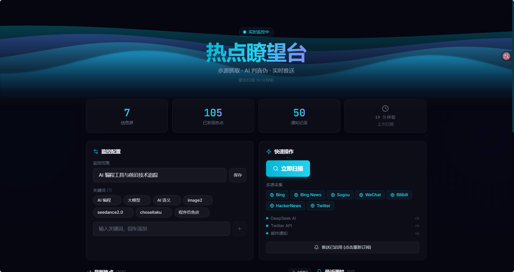
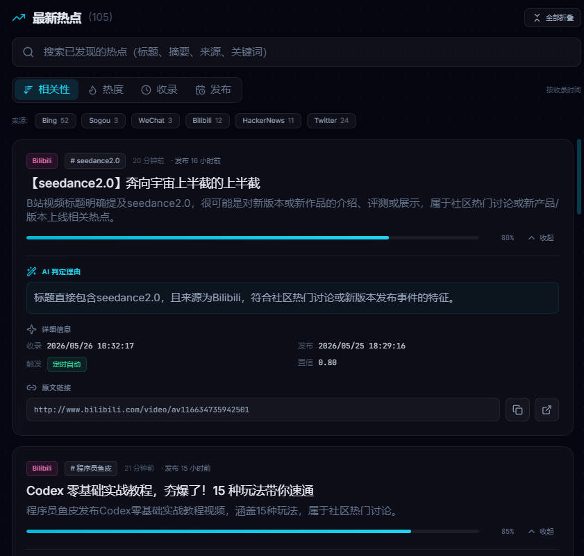

# 热点瞭望台 · Hotspot Monitor

一个轻量级的多源 AI 热点监控工具：从 7+ 搜索引擎并发抓取 → AI 判别真实热点 → 科技风 Web 面板展示，支持浏览器推送与邮件通知。



---

## 功能

- **多源并发抓取** — Bing / Bing News / Sogou / 搜狗微信 / Bilibili (WBI 签名) / HackerNews (Algolia API) / DuckDuckGo，每源独立超时与容错
- **AI 智能判别** — DeepSeek 为主、OpenRouter 兜底，输出 `isHot / confidence / summary / reason`
- **公平轮询算法** — 跨「来源 × 关键词」双层轮询 + 每源硬配额，避免高产源淹没小众源
- **科技风面板**：
  - 关键词增删改、监控范围编辑、手动触发扫描
  - 热点卡片：搜索过滤、来源筛选、4 种排序（相关性 / 热度 / 收录 / 发布）、分页
  - **卡片展开/折叠**：AI 判定理由、收录/发布时间、触发方式、置信度精确值、原文链接一键复制
  - 一键全部展开 / 全部折叠
  - 通知中心、置信度可视化、发布时间副标签
- **通知推送** — 浏览器 Web Push (VAPID) + 邮件 (SMTP / nodemailer)
- **定时扫描** — node-cron 每 30 分钟自动扫描



---

## 快速启动

```bash
# 1. 安装依赖
npm install

# 2. 配置环境变量
cp .env.example .env
# 至少填写 DEEPSEEK_API_KEY

# 3. 启动后端（端口 4000）
npm start

# 4. 另一终端启动前端（端口 5173，自动代理 /api → 4000）
npm run dev

# 5. 浏览器打开 http://localhost:5173
```

### 生产部署

```bash
npm run deploy        # vite build + 单端口托管（4000）
# 或分步：
npm run build         # 产出 dist/
npm run start:prod    # server/start-prod.js 托管前端 + API
```

---

## 环境变量

| 变量 | 用途 | 必填 |
|------|------|------|
| `DEEPSEEK_API_KEY` | AI 热点判别 | **是** |
| `OPENROUTER_API_KEY` | DeepSeek 失败时兜底 | 否 |
| `TWITTERAPI_KEY` | X/Twitter 检索 | 否 |
| `SMTP_HOST` / `SMTP_PORT` / `SMTP_USER` / `SMTP_PASS` | 邮件通知 | 否 |
| `EMAIL_RECIPIENTS` | 邮件接收者（逗号分隔） | 否 |
| `VAPID_PUBLIC_KEY` / `VAPID_PRIVATE_KEY` | 浏览器推送 | 否 |
| `PORT` | 后端端口，默认 4000 | 否 |

详见 `.env.example`。

---

## 目录结构

```
sei-hot-moniter/
├── server/           Express API · 定时扫描 · 各源抓取 · AI 调用 · 推送/邮件
│   ├── index.js      主入口
│   └── start-prod.js 生产启动（托管 dist/）
├── src/              React + Vite 前端（Tailwind / Framer Motion）
│   ├── App.jsx       主面板
│   ├── components/   UI 组件（动画背景、Bento 布局、粒子等）
│   └── lib/          工具函数
├── public/           service-worker.js 等静态资源
├── data/             运行时持久化（自动创建，已 gitignore）
├── hotspot-hunter/   Agent Skill — 零依赖独立抓取工具（见下方）
├── img/              截图
├── .env.example      环境变量样例
└── package.json
```

---

## 主要 API

| 方法 | 路径 | 说明 |
|------|------|------|
| `GET` | `/api/config` | 获取关键词与监控范围 |
| `POST` | `/api/keywords` | 添加关键词 |
| `DELETE` | `/api/keywords/:keyword` | 删除关键词 |
| `POST` | `/api/scope` | 更新监控范围 |
| `POST` | `/api/scan` | 手动触发扫描 |
| `GET` | `/api/hotspots` | 获取热点列表 |
| `GET` | `/api/notifications` | 获取通知记录 |
| `GET` | `/api/push-public-key` | 获取 VAPID 公钥 |
| `POST` | `/api/subscribe` | 浏览器推送订阅 |
| `GET` | `/api/health` | 服务健康状态 |

---

## Agent Skill — hotspot-hunter

项目附带一个独立的本地抓取 Skill，可在 Claude Code 中直接使用：

```bash
cd hotspot-hunter/scripts && npm install
node scout.js -q "AI coding tools" -s hackernews,bing-news -m 10
```

**特点：**
- **零依赖外部服务** — 无需 API Key、无需数据库、无需启动服务器
- **7 个免费搜索源** — Bing / Bing News / DuckDuckGo / Sogou / 搜狗微信 / Bilibili (WBI) / HackerNews
- **AI 分析由 Claude 完成** — 不调用 OpenRouter 或任何第三方 AI
- **stdout JSON 输出** — 适合管道和脚本集成

详见 `hotspot-hunter/SKILL.md`。

---

## 技术栈

| 层 | 技术 |
|----|------|
| 前端 | React 18 · Vite 5 · Tailwind CSS 3 · Framer Motion |
| 后端 | Express 4 · node-cron · cheerio · nodemailer · web-push |
| AI | DeepSeek API (v4-flash) / OpenRouter (GPT-4o-mini 兜底) |
| Skill | Node.js + cheerio（独立脚本，不依赖项目服务） |

---

## License

MIT
